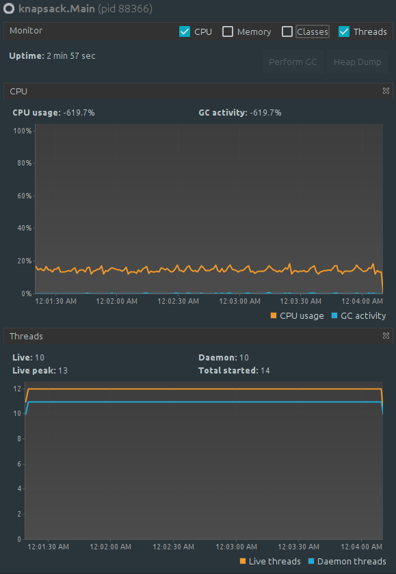
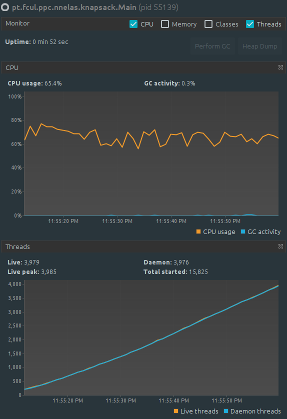
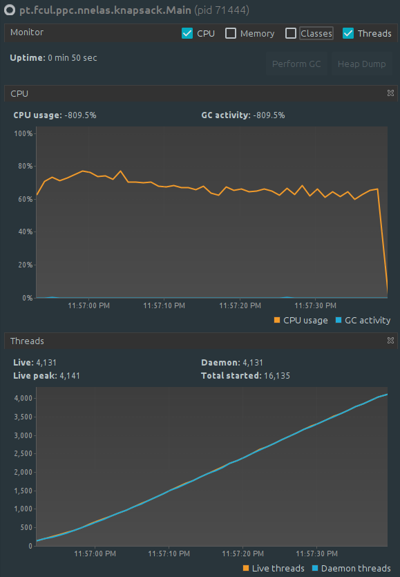

# Assignment 1: A Genetic Algorithm for The Knapsack Problem
```
    Author:    Nuno Nelas <fc51691@alunos.fc.ul.pt>
```


## Description of how parallelization was applied and rationale for the parallelization method used
From my point of view, there were 2 classes were parallelization could be done: 
`KnapsackGA` and `Individual`. These classes, since their implementation was somewhat 
repetitive (eg.: making the same operations over a list), brought a huge potential to 
parallelize.

My first approach to this problem was to try to parallelize both of them, starting 
with `KnapsackGA`.

This class orchestrates all the main routines of this solution. It creates a random 
population, calculates its fitness, sorts the population (by fitness), crossovers its
individuals to create a new population and then mutates it. This is done repeatedly until 
the maximum number of generations is reached.

Rationale to parallelize this class follows these rules:
1 - If it's a simple for-loop, try to use Streams (eg.: `populateInitialPopulationRandomly()`);
2 - If it's a complex for-loop, try to use Threads (eg.: `calculateFitness()`, `crossover()` 
and `mutate()`)

Also, for the second scenario, much of the implementation found on my source-code was 
inspired from the Matrix Multiplication exercise. Basically, I've split a large array (of 
`Individual`) into N similar pieces, where N (configurable on `Main`) is the number of 
available cores (in my case, is 8).
 
On the `Individual` class, I kept the same rationale: since these loops were simple enough,
I tried to use Streams as well. However, the situation was quite different here. This change 
led to sudden freezes and malfunction. My hypothesis here is that since I was already 
creating enough threads to occupy my 8-core processor, those extra ones for `static init`, 
`createRandom`, `measureFitness` and `crossoverWith` where generating enough overhead to 
make my system inefficient. (However, I haven't researched deep enough to confirm this).

This trial and error work led me to remove all changes from `Individual` and only 
replace `Random()` for `ThreadLocalRandom.current()`, since the first one has a poorer 
performance compared to the second (multiple threads share the same Random instance). 
Nevertheless, since `ThreadLocalRandom` doesn't allow to `.setSeed()` it cannot be used to
initialize `Individual` static block.

Finally, regarding the Sorting Algorithm, I've chosen to keep both QuickSort and MergeSort.
With both, I could easily implement ForkJoin mechanisms, since they follow a divide and 
conquer paradigm which fits ForkJoin model. To agile switching from both these algorithms, 
as one as the other are "wrapped" inside `MergeSortWrapper` and `QuickSortWrapper` which 
initializes the ForkJoin solution and its thread pool.

## Measurements showing whether parallelization was advantageous in each case
As the above screenshots from VisualVM show, parallelization was quite efficient, reducing 
in 2 minutes the execution-time. Also, there's no notorious difference between using 
MergeSort or QuickSort. What I can also conclude from these graphs is that we're exiting 
`Main` with a ton of still living threads, which I might think that we may benefit of a GC 
implementation to achieve additional performance.

| Original    |  MergeSort  |  QuickSort  |
| ----------- | ----------- | ----------- |
| { width=20% } | { width=20% } | { width=20% } |