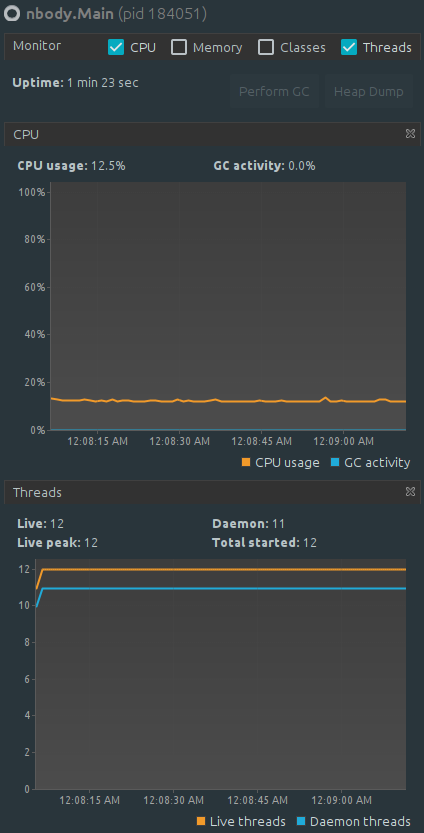
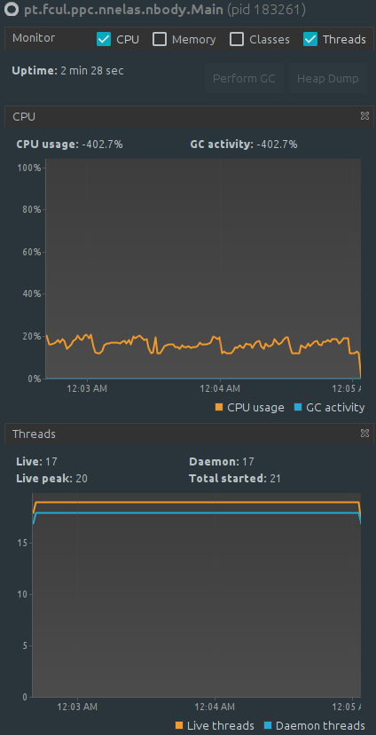

# Assignment 2: The N-Body Problem
```
    Author:    Nuno Nelas <fc51691@alunos.fc.ul.pt>
```


## Description of how parallelization was applied and rationale for the parallelization method used
Following the pattern of the previous assignment, this assignment focused a lot 
on a trial-and-error methodology, in which I've tried different parallelization 
methods to achieve the goal, which was to parallelize `NBodySystem.advance()` method.

Before even trying to parallelize it, there was a couple of things that I 
thought I could do to this method. On the assignment description we can find that 
this method has a `o(n²)` complexity. However, after analyzing carefully this 
method, we can conclude that it has, in fact, `o(n²) + o(n)`. This happens because 
there's a second for-loop to update x, y, z coordinates. To simplify this, I've 
extracted this logic to new method `void moveBody(NBody body, double dt)` and moved 
this inside the first for-loop.

I've also extracted velocity (vx, vz, vy) and mass calculations to a new method 
`void makeCalculations(NBody iBody, NBody body, double dt)`. As you can imagine,
this minor refactor wasn't made to increase performance. Just to make things easier 
when trying different parallelization methods.

Regarding the parallelization itself, I will now describe the methods used the 
obtained results. (Whilst testing these different methods I've always compared them 
to the results achieved with the sequential version.)

1) Using bare-bone Threads: Since we were dealing with lists, I thought that we 
could do a somewhat similar approach to "Matrix Multiplication" exercise. However, 
I couldn't just split the for-loop into N different parts and hope this would work. 
Every iteration has to have a reference to its past elements, so as I should have 
expected, this led to inaccurate `energy` results. 

2) Using ExecutorService: ExecutorService abstracts away many of the complexities 
associated with the lower-level abstractions like raw Thread. This seemed like a good 
choice. Basically, I've created a `newFixedThreadPool` with 
8 number of threads (to match my CPU specs) and instead of calling `makeCalculations` 
directly, I called it with `executor.submit`. This was terrible performance wise, even 
to the point of stop running the simulation because it was running for too long with 
my CPU at 100% on all cores.

3) Using Streams: With Streams I found that it was somewhat simple to parallelize 
the `advance` method. In practice, I would only need to 1) call `.parallel()` to 
iterate the for-loop in parallel; 2) call `.forEachOrdered()` to ensure that the 
items were executed orderly.

## Measurements showing whether parallelization was advantageous in each case
For this assignment I have used a machine with the following configurations: 

|            CPU                | CPU Cores | CPU Threads |  RAM  |   Operating System   |
| ----------------------------- | --------- | ----------- | ----- | -------------------- |
| Intel i7-8550U (8) @ 4.000GHz |     4     |      8      | 24 GB | Linux Mint 20 x86_64 |

As the above screenshots from VisualVM show, although using Streams API simplifies 
all that "hard-work" of managing tasks, it does not resolve all synchronization 
issues nor makes the solution faster. A parallel stream should not be used
when we have a massive amount of items to process, that only increases the 
thread coordination problem. To sum up, using Streams led to an increase of more 
than 1 minute between sequential and parallelized version.

|    Sequential    |  Using Streams  |
| ---------------- | --------------- |
| { width=15% } | { width=15% } |